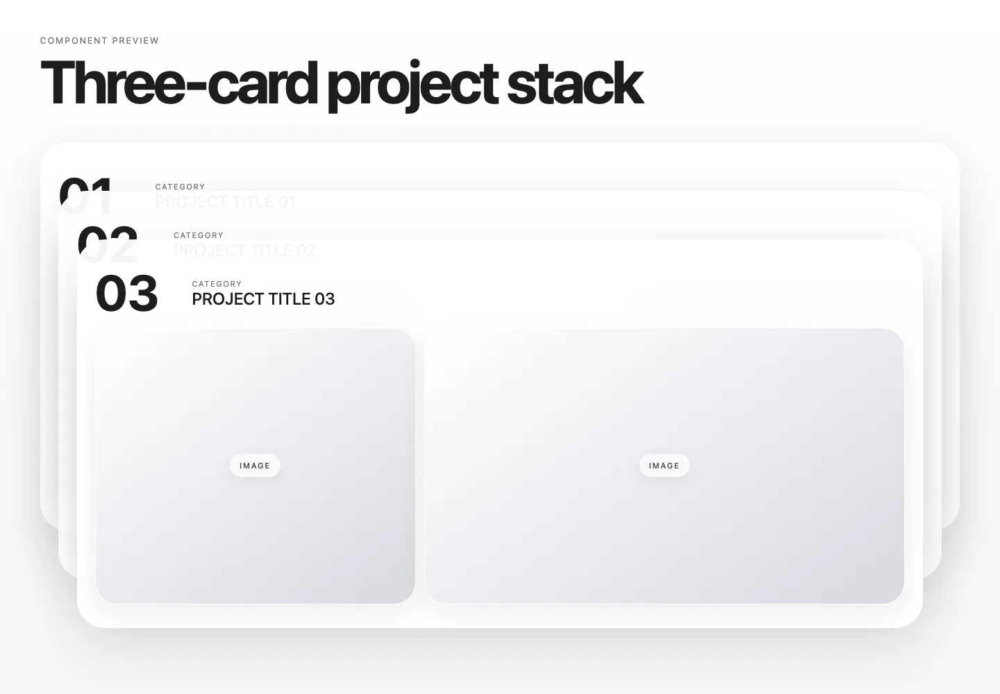

# Three-Card Project Stack

Three project cards stick, overlap, and scale while scrolling.

- Source: `ThreeCardProjectStack.tsx` and `ThreeCardProjectStack.css`
- Dependency: `framer-motion`
- [Public demo](https://connoer123.github.io/web-inspiration-lab/?demo=project-stack)

Import the stylesheet once and pass exactly three project objects. Each object needs a unique `id` and its own card content.
