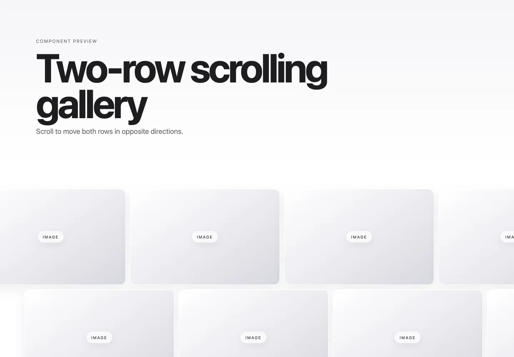

# Two-Row Scrolling Gallery

Two repeated image rows move in opposite directions as the page scrolls.

- Source: `TwoRowScrollingGallery.tsx` and `TwoRowScrollingGallery.css`
- Dependency: `react`
- [Planned public demo](https://connoer123.github.io/web-inspiration-lab/?demo=scroll-gallery)
- Local demo: `http://127.0.0.1:5173/web-inspiration-lab/?demo=scroll-gallery`

The public demo becomes available after GitHub Pages finishes its first deployment.

Import the stylesheet once, then pass an array of image cards or other visual items. Give each item its own width and height in the parent project.
