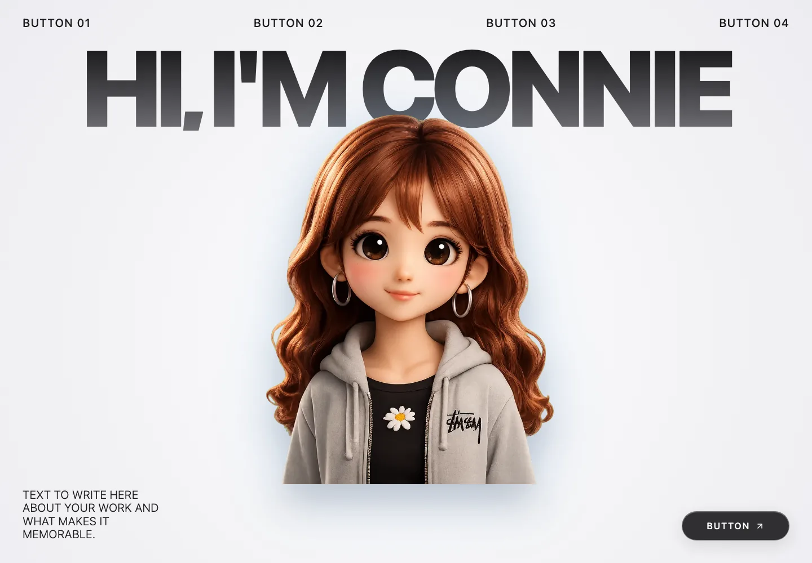

# Connie Creative Portfolio Template



[Public preview](https://connoer123.github.io/web-inspiration-lab/)

- Type: Full website landing page
- Status: Ready to customize
- Inspiration: [Motion Sites](https://motionsites.ai/)

## My interpretation

This reusable React portfolio template uses generic content, image placeholders, scroll reveals, a magnetic portrait, moving galleries, sticky project cards, and a contact form. Its visual direction was inspired by the creative motion work collected by [Motion Sites](https://motionsites.ai/).

## Customize it

- Replace the navigation labels and section titles in `src/App.tsx`.
- Replace each image holder with your own image or component.
- Replace the example portrait in `public/assets/`.
- Connect the contact form to your preferred service.
- Update colors and spacing in `src/styles.css`.

## Images and performance

Use SVG for logos, icons, and simple vector artwork. Use WebP or AVIF for photographs and detailed 3D renders. Converting a detailed portrait to SVG does not make it truly scalable; it usually embeds the bitmap or creates an unnecessarily large and inaccurate vector trace.

The example portrait uses `connie-portrait.webp`, an optimized transparent website asset. Keep your full-resolution source outside `public/` so it is not copied into the production build. Add `loading="lazy"` to images below the first screen when replacing placeholders.

## Portrait prompt

The portrait was created by Connie with ChatGPT using this prompt:

> Transform the person in the reference image into a cute, premium-quality 3D CGI character. Keep the exact hairstyle, hair color, facial structure, eye color, eyebrows, nose, lips, clothing, and accessories. Use oversized expressive eyes (without becoming unrealistic), soft rounded facial features, smooth skin, subtle rosy cheeks, and finely detailed hair strands. Render in the style of modern Pixar/Disney character design mixed with high-end collectible figurines. Use physically based rendering (PBR), cinematic lighting, soft ambient occlusion, realistic fabric textures, and ultra-detailed materials. Center the portrait in a chest-up composition. Remove the entire background and render the character as an isolated subject with a fully transparent background (alpha channel). Output as a high-resolution PNG with clean, anti-aliased edges, no shadows extending onto a background, and no gradient, studio backdrop, floor, or environmental elements. The final image should appear as a premium 3D character sticker or cutout while remaining an obvious 3D version of the original person.

## Run locally

```bash
npm install
npm run dev
```

## Credits and licenses

The implementation is written independently for this library. Motion Sites is credited for visual inspiration; no Motion Sites source code or imagery is included. The portrait is original user-provided artwork. See the repository-level license for the code license.
